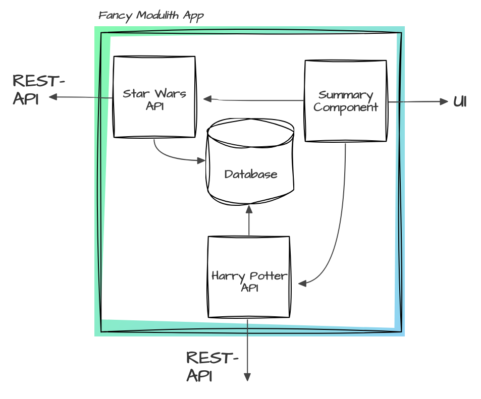

# Modulith Architecture Project

This project is structured as a modulith architecture with one main module and four submodules. Each submodule encapsulates a specific domain of functionality and can be run independently. Docker is used for containerization, with each module having its own Dockerfile and the main module having a `docker-compose.yml` for orchestration.

## Overview

This project consists of the following modules:

1. **Modulith Module**: Orchestrates the application using Docker Compose.
2. **Database Module**: Manages database interactions using H2.
3. **Summary Module**: Aggregates and summarizes data from the Star Wars and Harry Potter API modules.
3. **StarWars API Module**: Interacts with the Star Wars API.
4. **HarryPotter API Module**: Interacts with the Harry Potter API.



## Modules

### Modulith Module

The main module is responsible for orchestrating the application using Docker Compose. It does not contain a Spring Boot application itself but manages the deployment of other modules.

### Database Module

The database module manages all database interactions using an H2 database. It defines the entities and repositories used across the application.

### Summary Module

The summary module aggregates and summarizes data from the Star Wars and Harry Potter API modules, providing a consolidated view of the information. It connects to the StarWars and HarryPotter APIs to fetch the data.

### StarWars API Module

The StarWars API module handles all interactions with the Star Wars API. It fetches data related to Star Wars characters and movies and connects to the database to store this data.

### HarryPotter API Module

The HarryPotter API module handles all interactions with the Harry Potter API. It fetches data related to Harry Potter characters and events and connects to the database to store this data.

## Getting Started

### Prerequisites

- Java 21
- Maven
- Docker
- Docker Compose

### Running the Application

You can run each module independently or use Docker Compose to orchestrate them.

#### Using Docker Compose

1. Clone the repository:
   ```sh
   git clone https://github.com/svbuh/lal-2-architecture-modulith.git
   cd modulith-architecture
   ```
   
2. Build the modules
   ```sh
   mvn clean package
   ```
   
3. Build the Docker images:
   ```sh
   docker-compose build
   ```

4. Run the application:
   ```sh
   docker-compose up
   ```

#### Running Modules Individually

Each module can be run independently. Navigate to the module directory and use Maven to run the Spring Boot application:

```sh
cd harrypotter-api
mvn spring-boot:run
```

Repeat the above steps for the `starwars-api` and `summary-module` directories.

You can also run the applications with the run configurations in your preferred IDE.


### Docker Setup

Each module contains a Dockerfile. The `docker-compose.yml` file in the main module is used to orchestrate the deployment of all modules.

## Testing

To run the tests, use the following command:
```sh
mvn test
```
